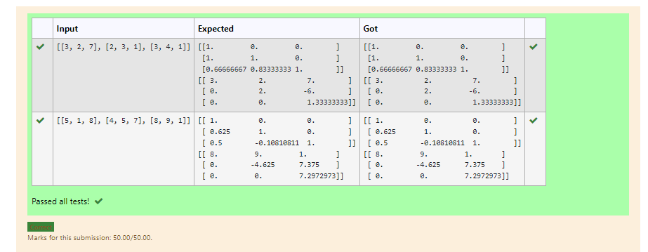

# LU Decomposition without zero on the diagonal

## AIM:
To write a program to find the LU Decomposition of a matrix.

## Equipments Required:
1. Hardware – PCs
2. Anaconda – Python 3.7 Installation / Moodle-Code Runner

## Algorithm
1. 
2. 
3. 
4. 

## Program:
```
/*
Program to find the LU Decomposition of a matrix.
Developed by:V.A.Jithendra 
RegisterNumber:21005049
*/
# To print L and U matrix
import numpy as np
from scipy.linalg import lu
A=np.array(eval(input()))
P,L,U=lu(A)
print(L)
print(U)
```

## Output:



## Result:
Thus the program to find the LU Decomposition of a matrix is written and verified using python programming.

# LU Decomposition without zero on the diagonal

## AIM:
To write a program to find the LU Decomposition of a matrix.

## Equipments Required:
1. Hardware – PCs
2. Anaconda – Python 3.7 Installation / Moodle-Code Runner

## Algorithm
1. 
2. 
3. 
4. 

## Program:
```
/*
Program to find the LU Decomposition of a matrix.
Developed by:V.A.Jithendra
RegisterNumber:21005049
*/

import numpy as np
import scipy
from scipy.linalg import lu_factor,lu_solve
A=([[3, 2, 7], [2, 3, 1], [3, 4, 1]])
B=([4, 5, 7])
lu,piv=lu_factor(A)
x=lu_solve((lu,piv),B)
print(x)
```

## Output:


## Result:
Thus the program to find the LU Decomposition of a matrix is written and verified using python programming.

